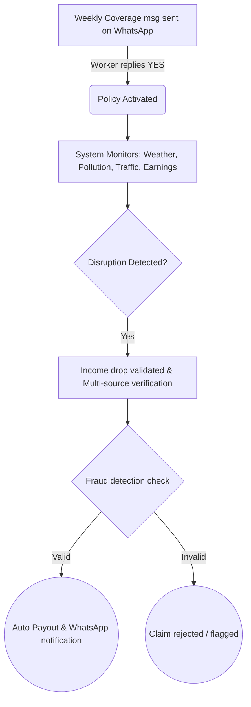

# 🛵⚡ Smart Adaptive Income Shield (SAIS)
> **When work stops, income doesn’t.**  
> *AI-Powered Parametric Income Protection for India’s Gig Economy*

---

## 📌 The Insight Nobody Talks About

Every InsurTech solution says “we support gig workers.” But very few understand how a delivery partner *actually* works during the day.

At 2 PM in extreme heat or heavy rain, a delivery worker is not opening dashboards or insurance apps. They are waiting near a location, checking their delivery app, and hoping for orders. When disruptions happen, their income drops instantly — but they neither track the loss nor file claims. 

**They don’t open apps. They open WhatsApp.**

SAIS is built around that real behavior. Workers interact completely through a WhatsApp chatbot — no app download, no complex forms, no manual claims. The web platform is only for admins, while the worker experience stays simple and familiar. And when a disruption happens? The system already detects it.

**The payout is processed before the worker even asks.**

---

## 📖 Table of Contents
1. [Why Gig Economy, Why Now](#1-why-gig-economy-why-now)
2. [The SAIS Difference - Core Innovations](#2-the-sais-difference---core-innovations)
3. [Persona Scenarios & Application Workflow](#3-persona-scenarios--application-workflow)
4. [Weekly Premium Model & Parametric Triggers](#4-weekly-premium-model--parametric-triggers)
5. [AI/ML Architecture](#5-aiml-architecture)
6. [Fraud Detection & Anti-Spoofing Strategy](#6-fraud-detection--anti-spoofing-strategy)
7. [Tech Stack & System Design](#7-tech-stack--system-design)
8. [Development Roadmap](#8-development-roadmap)

---

## 1. Why Gig Economy, Why Now
**The Gig Worker is Highly Vulnerable**

Delivery workers don’t just lose income when it rains. They lose income when multiple small disruptions happen together — heavy rain, traffic congestion, sudden drop in orders, pollution alerts, or even local restrictions. Their work environment is dynamic, unpredictable, and highly sensitive to external factors.

| Factor | Food Delivery | Quick Commerce (Zepto/Blinkit) |
| :--- | :--- | :--- |
| **Delivery radius** | 5–8 km | 1–3 km (localized zones) |
| **Disruption impact** | Gradual slowdown | Immediate income drop |
| **Dependency** | Multiple restaurants | Single hub / zone |
| **Income flow** | Stable over time | Highly fluctuating |
| **Weekly earnings** | ₹4,000–₹7,000 | ₹3,500–₹6,000 |

👉 **Why AI-driven income protection is powerful here:**
- Disruptions can be detected in real time.
- Income patterns can be predicted.
- Loss can be calculated accurately.
This makes parametric insurance more practical, fair, and effective for gig workers today.

---

## 2. The SAIS Difference - Core Innovations

### 🟡 Innovation 1: WhatsApp-First Worker Experience
Most solutions expect workers to install and use a new app. SAIS removes that barrier completely. A delivery worker earning ₹500–₹900 per day is unlikely to download, learn, and regularly use an insurance platform. But they *will* respond to a simple WhatsApp message.

*Example Message:*
> "Hi Ravi 👋 Rain detected in your area. Your coverage is active. If your earnings drop, compensation will be processed automatically."

### 🟠 Innovation 2: Zone-Based Risk Intelligence
Most systems use city-level data, which is too broad for gig workers. SAIS focuses on **micro-level zones**, where workers actually operate. Each zone is analyzed to create a Risk Profile using historical weather, pollution (AQI), traffic, demand, and local events.
*Precision-based insurance, not generalized coverage.*

### 🔴 Innovation 3: Income Gap as a Parametric Trigger
Most solutions trigger payouts only based on events like rain. SAIS introduces a smarter trigger: **Actual income loss**.
Even if a disruption is not captured perfectly by APIs, the income drop ensures detection, making the system more accurate and fair.

---

## 3. Persona Scenarios & Application Workflow

### Scenarios
- **Scenario A - Heavy Rain Income Loss:**
  *Ravi (Swiggy, Vijayawada).* Heavy rain slows down orders. SAIS detects the weather threshold, the earnings drop, and that nearby workers are also affected. Loss calculated, ₹350 credited via UPI. No claim required.
- **Scenario B - Pollution & Demand Drop:**
  *Fatima (Zepto, Delhi).* AQI crosses unsafe levels. Demand drops. SAIS detects the AQI threshold and demand drop. Compensation is activated automatically for affected hours.
- **Scenario C - False Claim Attempt:**
  *Group of workers in Mumbai.* Workers stop intentionally. SAIS detects no weather/AQI issues, normal activity among *other* workers, and normal demand. Fraud detected. Claims rejected.

### Application Workflow



---

## 4. Weekly Premium Model & Parametric Triggers

### The Weekly Model
Gig workers earn daily/weekly. A monthly premium is difficult to afford upfront. SAIS follows a weekly opt-in model. No long-term lock-ins.

`Weekly Premium (₹) = BasePremium × ZoneRiskMultiplier × WorkHoursFactor × RiskAdjustment × SeasonalFactor`

**Sample Weekly Premiums:**
| Worker | City / Zone | Risk Level | Hours | Season | Premium | Max Payout |
| :--- | :--- | :--- | :--- | :--- | :--- | :--- |
| Ravi | Vijayawada | Medium | 40 hrs | Rainy | ₹45 | ₹1500 |
| Fatima | Delhi | High | 40 hrs | AQI | ₹70 | ₹1500 |
| Arjun | Mumbai | High | 45 hrs | Monsoon | ₹80 | ₹1700 |

### Parametric Triggers
1. **Heavy Rain** (Weather API) -> *Income drop validation* -> ₹/hour
2. **Extreme Heat** (Weather API) -> *Work hours verification* -> ₹/hour
3. **High Pollution** (AQI API) -> *Demand/activity drop* -> ₹/hour
4. **Traffic Disruption** (Traffic mock) -> *Delay in deliveries* -> ₹/hour
5. **Low Demand** (Platform mock) -> *Peer validation* -> ₹/hour
6. **Area Restriction** (Govt/Mock) -> *Activity = zero* -> Full payout

---

## 5. AI/ML Architecture

SAIS is powered by four primary machine learning models working in tandem to calculate risk, adjust premiums fairly, flag fraud, and forecast financial exposure.

### 🧠 Model 1: Zone Risk Scorer (Risk Profiling)
* **Purpose:** Calculate the baseline risk level for each worker’s specific operating micro-zone, ensuring personalized risk assessment rather than a generalized city-wide guess.
* **Approach:** Clustering + Regression-based scoring.
* **Input Features:** Historical weather patterns, AQI (pollution) trends, traffic congestion history, platform demand fluctuations, and local disruption event history.
* **Output:** A dynamically updated Risk Score (Low ➔ High) for each mapped delivery zone.
* **Impact:** Directs the baseline calculation for dynamic premiums and coverage availability.

### 📈 Model 2: Dynamic Premium Adjuster
* **Purpose:** Proactively adjust the weekly premium up or down based on the upcoming week's anticipated risk conditions.
* **Approach:** Regression-based prediction model.
* **Input Features:** 7-day weather forecast, AQI predictions, seasonal macro-trends (e.g., monsoon season), and past claim patterns in that zone.
* **Output:** A percentage Premium Adjustment Factor (+ or -).
* **Impact:** If heavy rain is forecast next week, the premium adjusts slightly to reflect the higher probability of payouts. *Transparency Rule: Workers are always informed via WhatsApp exactly why their premium changed.*

### 🛡️ Model 3: Fraud Detection Engine (Multi-Signal)
* **Purpose:** Detect and prevent false or spoofed claims using a hybrid analysis system.
* **Approach:** Two-Layer Architecture:
  * **Layer 1 (Rule-Based Checks):** Hard checks for logic breaks (e.g., GPS mismatch, no active API disruptions, duplicate claim attempts, surrounding workers are active).
  * **Layer 2 (Pattern Detection):** Uses anomaly detection algorithms to identify coordinated group fraud attempts and abnormal individual behavior over time.
* **Output:** Calculates the final Fraud Risk Score determining Auto-Approve, Review, or Reject (See Section 6).

### 🔮 Model 4: 7-Day Risk & Exposure Forecaster
* **Purpose:** Provide platform administrators with an accurate prediction of future claim probabilities to ensure the system remains financially stable.
* **Formula:** `Expected Risk = Probability of Disruption × Active Workers in Zone × Average Payout`
* **Input Features:** Severe weather forecasts, upcoming AQI spikes, seasonal data, historical payout rates.
* **Output:** Financial risk estimate & exposure dashboard for the upcoming week.
* **Impact:** Allows admins to plan liquidity for payouts, visually map upcoming high-risk zones, and optimize system load proactively.

---

## 6. Fraud Detection & Anti-Spoofing Strategy

A critical system risk: workers acting maliciously by faking their location (GPS spoofing) or intentionally staying offline to claim false income loss during non-disruption periods. SAIS leverages the physical reality of the gig economy to detect this: **a worker can fake their GPS, but they cannot fake environmental conditions, the behavior of other workers, or zone-level demand patterns.** 

SAIS uses a four-point framework to stop misuse:

### 1. Multi-Signal Validation System (Genuine vs. Fake)
Instead of relying on just one data point, SAIS validates the entire situation by cross-referencing multiple real-time signals.

| Signal | What It Checks | Risk / Fraud Indicator |
| :--- | :--- | :--- |
| **Location Match** | Worker is in the registered zone | Mismatch indicates GPS spoofing |
| **Activity Level** | Active app usage and orders | Complete inactivity without disruption |
| **Peer Comparison** | Nearby workers' activity | Surrounding workers are active and earning |
| **Demand Check** | Order volume in the exact zone | Normal demand volume confirms no real issue |
| **Historical Behavior**| Worker's normal operating patterns| Drastic sudden change from past weeks |
| **Time Validation** | Within expected working hours | Disruption claimed outside active hours |

**Risk Scoring System:**
All signals are combined into a final Fraud Score (0 to 1).
* **Score < 0.3** ➔ **Auto Approve** logic triggered (Genuine disruption)
* **Score 0.3 to 0.7** ➔ **Under Review** (Flagged for soft-check)
* **Score > 0.7** ➔ **Reject** (Clear fraud pattern detected)

### 2. Detecting Coordinated Group Fraud
SAIS connects the dots across the entire network to detect coordinated anomalies, such as groups of workers unionizing to manipulate the system:
* Identifies **multiple workers becoming inactive** at the exact same moment.
* Tracks **sudden, abnormal spikes in claims** in a single zone.
* Analyzes **simultaneous login/logout behavior** and identical payout destination patterns.
* Trigger: *If suspicious claims > normal baseline ➔ Pause automated payouts and flag the cluster.*

### 3. Grace Mechanism (Protecting Genuine Workers)
Real physical disruptions (like floods) naturally cause poor network connections, bad GPS accuracy, and forced inactivity. SAIS ensures innocent workers aren't falsely banned using a Tiered Evaluation process:
* **Tier 1 — Auto Approve:** Strong correlating signals. (Instant Payout)
* **Tier 2 — Soft Verification:** Conflicting or weak signals. The system adds a brief delay to collect more API data. *(Sends message: "We are verifying your disruption. You will receive your payout shortly.")*
* **Tier 3 — Reject:** Explicit mismatch across all signals. *(Sends message: "Unable to verify disruption. You can request review.")*

### 4. Real Scenario: How Fraud is Blocked
A group of workers in Mumbai intentionally stays offline without any real-world disruption. 
* **The SAIS Check:** The system sees no weather or AQI anomalies, detects that *other* workers in Mumbai are completing orders successfully, and verifies that overall delivery demand in that zone is normal. 
* **The Result:** The system registers a maximum fraud score because all validation vectors failed simultaneously. The claims are instantly rejected and the pattern is recorded.
---

## 7. Tech Stack & System Design

### Architecture
- **Worker Interface:** WhatsApp Bot (Twilio / Meta API) via Node.js/Python session state backend.
- **Web Dashboard:** React + TypeScript (Charts, Map visualizations, Admin panel).
- **Backend Core:** Node.js/Express or Python FastAPI (Scheduler, Otp-based Auth, Triggers tracker).
- **Services:** MongoDB/PostgreSQL, Redis (caching), ML Services.
- **APIs:** Weather APIs, AQI APIs, Mock Traffic/Demand APIs, Payment gateway simulations, Twilio.

### Core Database Schema

```sql
-- Workers: id, name, phone, zone, avg_income, weekly_hours, risk_score
-- Policies: id, worker_id, week_start, week_end, premium, coverage_limit, status
-- Triggers: id, zone, type, severity, start_time, end_time, verified
-- Claims: id, worker_id, trigger_id, income_loss, payout, fraud_score, status
-- Payouts: id, claim_id, amount, status, timestamp
```

---

## 8. Development Roadmap

- **Phase 1 - Build (Weeks 1–2):** Zone-based risk model design, core triggers, WhatsApp flow setup, basic fraud rules, project foundation.
- **Phase 2 - Implement (Weeks 3–4):** Full WhatsApp OTP onboarding, weekly opt-in activation, dynamic premiums, automatic payout logic, admin dashboard.
- **Phase 3 - Optimize (Weeks 5–6):** Advanced pattern-based fraud detection, map zone visualizations, E2E testing, final demo.

---

## Why SAIS Wins

| Traditional Approach | SAIS Approach |
| :--- | :--- |
| Requires mobile app | Works on WhatsApp |
| Event-based triggers | Income-based protection |
| Generic pricing | Dynamic weekly pricing |
| Manual claims | Automatic payouts |
| Basic fraud checks | Multi-signal validation |
| Static models | Adaptive AI system |

---

## 👨‍💻 Team & Links

| **Name** | **Role** |
| :--- | :--- |
| SUDHEER | Full Stack / Backend |
| JESHNAV | AI / ML |
| BHAVANA | Frontend |
| SANA | Testing / Support |

- **Demo Video:** [Add link]
- **Live Demo:** [Optional]

***

> *SAIS is built for real workers, real problems, and real conditions. Simple to use. Automatic in action. Reliable when it matters.*
